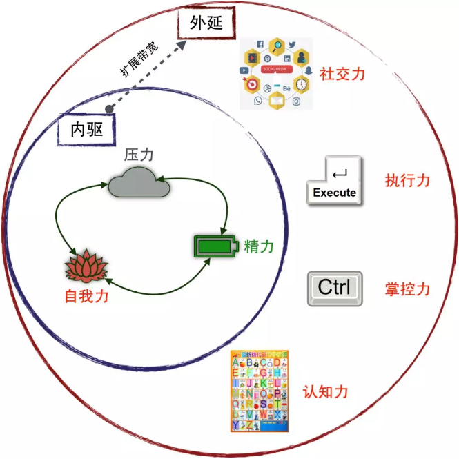
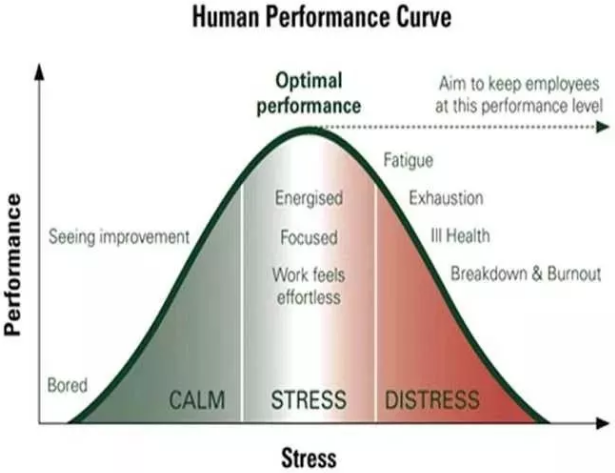
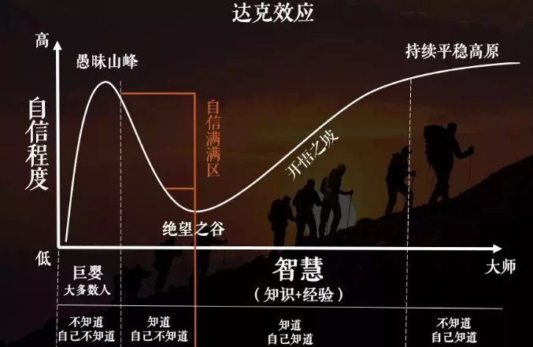

程序员当属工程师类别，而**工程师的核心能力**，在我看来有且仅有一个，那就是**“解决问题”**，即便还没有成功的解决掉问题，那也必然是在解决问题的路上(比如科研类工程师短期内并不一定有成果)。

如果问题最终没有被解决，之前的种种努力很容易变得微不足道。另外，不同于科研领域，程序员面对的大部分问题通常是具体、明确和有章可循的，故而如何“高效”地解决问题对于程序员来说愈加重要。

今天我们就说道说道高效这件事，我不会讲那些老生常谈的类似**番茄钟**、**二八原理**、**重要紧急象限**等方法之术，而更多是思想之道和实用小建议。

# 1 何为高效

效率的文字定义无需赘述，直接抛出个公式。翻译一下就是，程序员的效率一定是单位时间内产出的“**有效**”的交付物。敏捷著名的四条宣言，其实提炼到本质只有两个字，就是“**价值**”，而高效无非就是**尽可能快**的产出**最大价值**的交付，有价值才有效。

公式里第三个关键点是“**工期**”，你们猜到我要说什么了？笑话，那么容易被猜到就不是大爷本爷了。

从爱因斯坦的狭义相对论延伸出了个**时间膨胀效应**，物体速度越快，相对时间越慢，就好像时间被拉长了。把一天24小时拉长到48小时，没人有这本事，但是**人们擅长压缩时间**。比如大学期末考试最后一个月的突击学习可能顶得上一个学期(当然效果会大打折扣)，中学暑假最后一周的突击也可以写完作业，也就是一个学期/暑假的工期被我们缩短成了一个月或者一周，俗称的拖延症，不到最后一刻不动手。但如果我们在一开头就用上最后突击采用的**百分百努力**，提前完成，后面就可以有充盈的大把时间做更多有价值的事情了(即便是玩，也更加无负担吧)，这种时候你就会感觉时间被拉长，你品，仔细品，是不是这么回事！

> 这种『百分百努力』就是最高效的场景。

接下来我会从**内驱**和**外延**两个维度来说下**做到高效需要在观念上进行的升级**。为方便后文的直观理解，先上个Venn韦恩图。

# 2 内驱

每个个体的**内驱力**强弱各有不同，体现在效率上就会天差地别。**管理好内驱力是高效的必要条件，它们分别是：自我力、精力和压力的管理**。

## 2.1 自我管理

自我力是个体的立身之本，修炼自我，就是修炼**专业技能**，修炼**自我意识**，修炼**人生态度**，修炼**气质气魄.**..后面这些很多是扩展个人**心智带宽**之用，但至少专业技能得跟上吧，否则高效不就是个笑话。价值观可以避免误入歧途，走了岔路效率越高死的越快；自我意识可以防止人云亦云，左右摇摆以至浪费时间；人生态度让自己在坚信的那条路上努力拼搏；气质气魄的修炼可以让自己在号召力/掌控力(后文讲)上游刃有余。

弗洛伊德阐述过的人格结构理论中，认为包括**本我、自我和超我**。简单理解本我就是最原始的本能和欲望，自我才会带有意识和思想，而超我是内在良知和道德伦理。本节提到的自我力其实就是第二个层级，也就是包含(求生)本能和意识相对完整的自我个体。故而自我管理，除了对技能的升级管理，也包括意识思想上的升级管理。至于分别如何升级，话题太大，本篇展开不了。

**心智带宽**：哈佛大学行为经济学家塞德希尔·穆来纳森在著作《**稀缺：我们是如何陷入贫穷和忙碌的》**里提出的概念。所谓的带宽就是指频带的宽度，一般是指计算机网络中数据传输的能力。**心智带宽无非就是大脑在记忆、存储、检索、计算和控制等方面的能力，能力越强意即带宽越宽**。

## 2.2 精力管理

有没有发现优秀的人精力永远特别的旺盛？精力的良好管理是到达优秀的必要非充分条件。作息、运动、饮食、环境等是影响个人精力的最基础因素，除此之外还有：

1. **饱含热情**：翻开书篇，哈欠连天；抖音出手，精神抖擞。抖音平台上的各种搞笑段子、层不出穷的帅哥美女、美食、豪车都足够吸睛，吸引力大了热情自然就有了；相形之下读书则枯燥的紧，没有对知识的渴望，永远只能是被动的读书。**热情是一种结果，它是因为某种原因(比如信仰/爱好/环境等)个体对事物产生的强烈的情感连接**；热情更是一种力量，它会促使个体在行动力上勇往无前。

2. **强大意志力**：意志力也是精力的一种。意志力不光体现在控制饮食、坚持锻炼诸如此类表面意志，意志力的本质是有能力**合理**和**有序**地分配自己的精力。人的精力是有限的，按照能量守恒定律，在A事务上投入的精力增多，在B上相应的必然会减少。A 若是娱乐、游戏这种享乐活动，人们会不自觉的在此类事务上消磨大量时间，而锻炼、读书、工作这种有难度有挑战的B 类事务，人们更倾向选择回避或拒绝。

   只玩乐不学习容易成为废物，只工作不会生活紧绷的弦儿容易断，所以意志力不是非A即B非黑即白，需要“**合理分配**”。有的人做事喜欢先易后难，有的人喜欢先难后易；有些“烂好人”会不惜打断自己的节奏先帮别人做事，有些“难相处的人”会拒绝“第一时间”去帮忙，先维持住自己的节奏。“烂好人”可能会有好口碑但是经常做事低效，“难相处的人”可能会被人诟病但是做事高效有原则。“**有序分配**”自己的精力同样需要意志力的介入，不做“烂好人”，**永远优先做“最重要的”而不是“最紧急的”事**。

3. **仪式感，**通俗一点说就是**不将就**，它可以让无趣变有趣，粗糙变精致，平凡变神圣，腐朽变神奇... 沐浴焚香、洁案净几这么一整套仪式做下来，你一定会更加专注于读书写作；摆盘可以让一道菜更让人有胃口；带上降噪耳机打开舒缓音乐开始一天的代码工作...所有的这些仪式看起来有点无足轻重甚至繁文缛节，实则恰恰相反，仪式会营造一种强烈的心理暗示和氛围，会让你更平静、更专注、更快速的进入接下来的状态中。在仪式上花费小小的精力可以让后续的行动更有效率，绝对合算的买卖。

> **《稀缺的手术室》**
>
> 美国圣约翰医疗中心长期被一个问题困扰：医院一共32间手术室，每年要进行3万多台手术。医生的手术日程被塞的满满的，还不时有临时的急诊手术插进来，导致手术室外永远是等待做下一台手术的医生和患者。后来请一位资深医院管理顾问给方案，药方是：空出几间手术室，专门做急诊，不许安排任何常规手术。
>
> 手术室已经如此捉襟见肘了，还要减少手术室做急诊，因为急诊并不是随时都有，很可能意味着空放着浪费资源。那么，这个药方背后的深意是什么呢？
>
> **合理的规划、预留带宽比天天忙忙活活，更有效率**。你再想想你不管买再大的硬盘是不是永远塞得满，这“手术室”“硬盘”都是你的资源，精力同样是，不要等到资源不足的时候才想到清理，提前规划起来，否则就会面临下面要说的压力了。

## 2.3 压力管理

都说现代人的压力大，越成功的人面对的压力越大的无法想象，追求成功避不开学会管理压力。对于压力，我会简单划分为：**适度压力**和**超负荷压力**。两者的区别是，前者可以让人更有效率，后者可能把人压垮。不要谈压力色变，适度的压力是好事。主动寻求压力让自己不落于平庸是为输入，积极地把压力转化为动力、或者把压力通过其他管道宣泄掉是为输出，如此循环往复达成一种平衡。

“主动寻求”的压力有内/外部之别。同样的工作同样的工期，正常达成和完美达成的标准线不同，带来的压力当然也不同，这源自内心自我要求有多高，是内压；压力的“输出”也有转化和转移之分。**压力转化为动力的第一要诀就是勇敢面对，其他的交给上帝**。不是所有压力都需要转化为动力的，人生不能过于劳累，把压力宣泄到别的管道去，比如健身/饮食/旅行，可以有效的缓解甚至消解压力。注意宣泄不是逃避，休整只是为了更好的出发。

那么超负荷压力应该如何应对呢？其实非常简单，把它拆解成一个个“适度”的压力，各个击破即可。说起来简单。泰山崩于前仍能云淡风轻，需要非常人的气魄和胆识，越是压力巨大越应该冷静应对。请大家记住一个“**沙漏哲学**”，人这一生就像沙漏，一生面对无数的砂砾，但沙漏口可以流过的沙永远是那么一丝，不增不减，不急不躁。

Yerkes-Dodson法则（叶杜二氏法则）认为，压力与业绩之间存在着一种倒U型关系，适度的压力水平能够使业绩达到顶峰状态，过小或过大的压力都会使工作效率降低。瞧，不谋而合。

还有研究表明，抗压力与自信心呈正相关。高度自信的人往往越能胜任压力。自信的本质就是自我认同，自信的前提是曾经的成功经验或成就。无来由无根据的自信是盲目的自负。自信是“知道”自己可以做好，即使是面对压力，依然坦然面对；而自负是“以为”自己可以做好，面对压力原形必现。

# 3 外延

前文提到的内驱力体现**个体修为的高低**，而接下来讲到的带宽扩展，就体现**提升空间的大小**了。这些都是影响效率的关键因素，分别是**认知力、社交力、执行力和掌控力**。

## 3.1 认知力

所以把认知力放在第一位，是因为它决定了一个人的生存能力。从“我”的角度看这个世界，只有两个主体，一个是“自我”一个是我之外的“世界”。认知能力是让人“做正确的事”的基本要求，事情都不对，可别提什么效率了。

前文提到了自我管理、自我升级，还有一个更重要的是**自我评价**。直指灵魂的一句拷问“你了解自己吗？”，没人有百分百把握答的准确或者相对准确。心理学上著名的“**达克效应**”解释了一种**认知偏差**，越无知的人越看不到自身的不足越容易犯错，而越渊博的人越虚怀若谷越容易成功。而人类又特别善于高估自己，就很容易进入认知偏差的陷阱，导致自我认知不足。当自我评价相对准确的时候，自信会随之而来，自信的好处不言自明。

“程序员对世界的认知从建模开始”，这是个玩笑也可以不是玩笑。想一想，我们不就是从抽象一个一个的对象/实体，然后建立它们之间的关系开始的么？(似曾相识的E-R图)我无法也没能力告诉大家怎么理解世界，我自己都还懵懂着...但人生很长，有大把的时间可以让我们去探究世界的本质，这就是认知力的锤炼。

## 3.2 社交力

坦白说，我个人也不擅长/不喜欢跟人打交道，因为跟机器打交道单纯许多。但是你不得不承认良好的人际关系，可以让你的很多工作事半功倍。`LinkedIn` (领英)创始人打过这么一个比喻：**扩展人际关系就像是用牙线清洁牙缝一样，一点不好玩，但是很重要**。

程序员特有的清高和自负似乎与人际社交天然绝缘，有人自视甚高到认为别人应该主动相交于自己(本人就曾经这么龟毛过)，也有人把社交等同于互相利用和功利主义，弃之如敝履。不是没见到过坐隔壁桌的两个程序员就是不面对面说话非得用微信打字交流，也不是没见过入职大半年只跟座位方圆一米内的人说过话而已。我把这些拿到台面上说出来，大家会觉得都不是什么好的品质，但其实程序员或多或少都会有这些毛病。

我们要做的不是刻意奉迎、压抑本心，而是**以真诚换真诚，以赞美换赞美，以高尚换高尚**...等一下，好像抽象偏了，咱们具体一点。程序员职场里的人际关系特别简单，没什么是一次咖啡、一次聚餐、一次`KTV`、一次手游或者一个红包解决不了的！不然就TWICE/THRICE...直到解决！记住，职场里的“酒肉朋友”是最为稳妥的人际关系，这是本人几十年来的深切体会，你可以仔细品。

## 3.3 执行力

执行和执行力是完全两码事。老板**说**什么你做什么，这是执行。老板**想**什么你做什么，这才是执行力。阿里巴巴的彭蕾更是有一句直冲脑门让老板们热血翻涌的名言：“无论马云的决定是什么，我的任务都只有一个，帮助这个决定成为最正确的决定”。

> 所谓**执行力**，指的是贯彻战略意图，完成预定目标的实际操作能力。它是企业竞争力的核心，是把企业战略、规划转化成为效益、成果的关键。

度量执行力这款产品的北极星指标就是“**目标的达成度**”。简单的 6 个字背后可大有深意：

1. 目标是否明确？

   SMART原则

2. 目标如果不明确，如何尽快领悟需求方(不明确的需求通常来自老板)意图？

   多沟通不存疑

3. 如何确保领悟的需求方意图是正确的？

   小交付快验证

4. 如何确保实施的速度是上级接受的？

   进度透明化

5. 实施难度过大，如何与上级沟通？

   轻吐槽重方案

6. 实施难度过大，如何与平级或下级沟通？

   敢把鸡毛当令箭

7. 如何在上级明确的意图之上再多迈出一步？

   闻一以知十

8. 实施过程是痛苦的，如何让结局是美好的？

   包装，但不能扯犊子

这里的 8 个问题我都做了点 Tips 在下方，相信大家都能懂。稍微展开一下，比如第 4 点其实就是求快的问题，一旦延期就特别容易会被扣上“执行力差”的帽子。还有一种特别普遍的情况，就是任务很明确，但是任务截止时间没有明确，老板的意思通常是越快越好，下属恰恰相反，没说时间就慢慢做，直到老板催账的那一天来临。**执行速度**是执行力的第一外衣。美国传奇富豪乔布斯的天使罗斯·佩罗说过“**我们成功的秘诀是：预备、发射、瞄准**”。看到没，是先发射再瞄准，追求的不就是一个快嘛，等你瞄了半天啥都没做出来，兔子早就跑光了。

## 3.4 掌控力

掌控这个词乍听起来感觉像是管理者需要具备的技能，其实不然。每个人都有自己可掌控的范围，前文的“意志力”就是就是一种掌控力。区别于通过“权势”带来的掌控力，我们说的掌控力，是通过知识、技能、魅力、思想等实现的控制。程序员需要掌控什么才能高效呢？

第一个当然是**掌控时间**，需要各种技能的辅助方能达到。程序员每天大大小小的会占用了很多时间，若会上有超出议题的发散性讨论，你能掌控住把话题拉回来么？当有人求助于你，而你在忙另一个重要任务，你的人际关系会让你陷入不得不先帮忙的境地么？如何掌控好面子与里子的**选择**？所以让自己的时间有效利用率最大化，就是掌控力在效率上的关键。

第二个是**掌控自由**。自由这个词放这里，感觉我要升华一下主题开始胡来了。其实我想说的不过是流程、规范、约束！有不少初创团队一开始路子野一些，做的“持续交付”就是合并代码、手工打包、线上替换Class等等，偶有发现线上逻辑和代码库里完全不一样的灵异事件。所以开始有了分支开发规范、有了测试报告规范、有了线上操作规范，这些是束缚么？是的。但是这个角度只是井中观天，换个角度，这些规范是给所有人生造出一条康庄大道，大家都按部就班，每个环节都严格把关，你能说流水线是束缚是低效的么？福特当年开发的世界第一条汽车流水线，这个流程革命可是成倍的降低了成本、提高了效率，带来成倍的利润。

所以，程序员们别故作清高打着自由和创新的旗号了，**我们中的99%写的代码并不优秀，需要代码规范；我们的代码质量并不高，需要代码评审；我们的提测质量并不咋地，需要单元测试覆盖率；我们99%的代码改变不了世界但可能被黑客给改变，所以需要信息安全规范**；So...

最后一个是**掌控权责**。前面似乎说了程序员的很多坏话，要认怂说点好话了。程序员都是可爱的、害羞的、真诚的，所以当把某种责任分派给一个程序员的时候，他/她一定会全力甚至是独立完成。而对于“权”，程序员通常不会好意思用，这也是技术人在转管理时特别普遍的情况。你会发现，有些人因为不好意思让人加班，自己加班到深夜；有些人把高难度的任务留给自己，让其他人做现成的。这里说的是应该做好向下管理或者向下授权。

还有一种操作叫“求权/威慑”，也就是狐假虎威。当你的任务因为一些不可控因素卡滞了，你可以尽快找你的上级说明情况，让他下达指令，比你自己求爷爷告奶奶轻松百倍，但这招要慎用。一来这种卡滞你要确定是你努力过但是没法推动的事务，否则老板真的会把你当成假借虎威的“狐狸”；二来处理不好容易引起同事关系的紧张，有“打小报告”之嫌。再说个小技巧，如果你拉个群来协调各方事务，预见到会有一些不和谐的情况的话，把老板也拉进群里，不需要他干啥，但是威慑在就会有奇妙的化学反应。