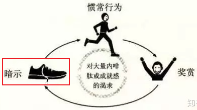
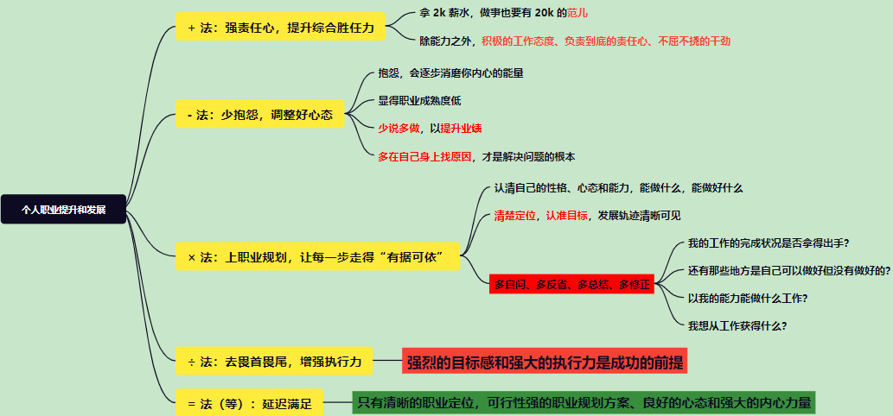

▍无论何时，不要放弃**阅读**，尤其是阅读**经典著作**

* **”从书上学，从事上练，和高人聊！“**，我特意调整了顺序，请体味其中的意义。

▍时刻让自己**心存正念**，唤醒你心中的“巨人”！

* **乐观**的思维方式，从而养成**好的习惯**；

* 在职场，特别要**端正态度**。态度占工作中很重要的位置！**“没有做不好的事，只有做不好事的人。”**
* 不抱怨，你需要唤醒的是你内心的“巨人”，而不是“巨婴”。遇到问题，多从自己身上找原因，问问自己还有什么做得不够好的，有则改之无则加勉。

▍意识到自己有**情绪**时，要及时“停下来”。

* **当你意识到自己出在情绪的“低洼处”时，请及时停下来！**比如，有负面情绪、负面思想时。
* 做一个温和的人，淡定且谦和
* 当你愤怒时，不做任何决定，愤怒下的决定，不仅容易伤害别人，自己消气后也多半会后悔。生气时，深呼吸三次，能有效缓解愤怒。

▍**有意识**地去**记录**你所做的工作，你的**思考**、**想法**，在做完一件事时，及时**复盘**整个过程，并尝试**改进**自己

* “吾日三省吾身”，每天早上计划每一天的各项事务，每天晚上就寝之前复盘整个一天的经过。思考：哪些地方需要改进，哪些地方做得好需要持续。
* 很多事实已经证明，不复盘的工作等于没做！**学会复盘**：**回顾目标**：当初的目的或期望是什么？**评估结果**：和原定目标相比有哪些亮点和不足？**分析原因**：事情成功和失败的根本原因，包括主观和客观两方面。**总结规律**：通过上面几点进行的分析，做出对应的措施。如新的方案设立或旧方案的调整。
* 经常去**总结**自己的实践，去**归纳**、**总结**，由此达到**高效**。做一件事，思考出多种解决方案，并比较方案的异同。再次遇到这些问题时，就不会只需要“唤醒记忆”即可。**学习，实践（反馈），总结归纳，再实践，循环往复**......归纳总结，才会看到**事物的规律和本质**，紧接着才能把规律运用到接下来的其他事情中。

▍**体能训练**，长跑、瑜伽，练练深蹲、卷腹（腰部力量很重要）

* 有了好的身体，才有更多持续的时间（珍惜时间），才不会受物理层面的束缚。

▍培养**思考力**、**思维方式**和逻辑

* **结构化**的思考方式

▍持续不断地接受**新的挑战**

* 之所以重要，是因为：人生是一个上台阶的过程，而不是上坡的过程。区别在于：前者是有一个阶跃过程，而后者是缓慢上升。“阶跃，是需要付出极大的努力，而且每一次都不一样！”
* 可能是你不懂的，不会的，从来没有接触过的。

从这个地方开始，进入**职场**需要具备的能力：

自我描述和评价的话，我认为最能体现特征的是：工作能力强

▍**选择**比**努力**更重要，**方法**也比努力重要

* **努力**只是当代人最基本的标签。
* 前期可以看猎头，后期则是关系网络。把自己托付给值得信赖的、多次行为已经证明的朋友，这样更靠谱。
* 要杂学、博学，什么都看，都认为是有用的；**找到定位**，选定若干个方向。扩大知识的面，工具、平台，都要去看、去了解。
* 找到**聪明人**，并和他们**一起共事**；找到**明白人**，并他们**交流观点**。**和优秀的人共事，和他们一起完成项目，是最简单的提升手段！**
* 到任何一家公司，都要重新“证明自己”。让招我的人，认为是正确的选择！找到**问题**，也就是**价值**所在！**把基础架构重新“撸”一遍**，从这个角度出发，这是最“单纯”、“高效”的招数。
* 软件实践的**方法论**：比如多线程和并发编程，不应该是独独一遍又一遍地巩固基础知识，而应该是掌握一定程度后开始**项目实践**，在实践中**踩坑-填坑-总结归纳-升华基础**，往后将是多个这样的循环……**在职场中，实践比理论知识更重要**。不仅如此，还需要把工程实践中相关的模型、使用的 `API`，以及这整个过程中的思考、遇到的问题记录下来，这些都是可以升华思维、认知、知识的源头（现实的工程需求是丰富多彩的，各种不同的需求和场景对知识的应用提出了各种不同的要求），所以可以进一步说明工程实践的重要性。

▍持续**接收外界反馈**，持续**评估自己**

* 创建自身的**正循环**和**正反馈**。
* 一次**面试**，是一次**评测**，也就是**找到自身的价值**所在。看看，自己到底能创造多大的价值！

▍**学习**和**持续积累**

* 学习，是跟年龄没有关系的。35岁才是一个非常好的年纪、状态最佳！心智成熟，才是一个好心态，在工作中“玩”。
* 不管做什么事，最怕积累，积累得久了，即使没有大成，也必然有小成。
* 留心自己看到的一切，特别是工作中，好好积累，以后总会有用。
* 做什么不重要（大方向是对的），**怎么做才重要（How to do!）**。**夯实基础**，积累沉淀，**多做分享**，多做沉淀。
* **打基础**，是后面走得很远的保证。**学会了分享，这个知识才是自己的**。

▍对于**技能**，你需要**不断地、刻意地**去**练习**、**实践**，并从**结果**中获得**改进的反馈**

* **”从书上学，从事上练，和高人聊！“**
* 不遗余力地去实践和实操，~~失败了再去重复 6 次。~~经过这些步骤，你总能从中思考出什么！不是因为失败而想着再去尝试，而是想着怎么改变自己的看问题、思考的角度。吴其敏老师就说过：**在实践上，他自己肯定是比其他人花了更多的时间，自认为不是一个聪明的人！**
* You do, you know. ——吴其敏 CAT 监控系统。纸上得来终觉浅，绝知此事要躬行。
* 看到的、听到的，你只有**试过**了（花时间去**执行**），不断地**犯错误**，在你练习的过程中，**不断地问为什么**，才能**深入**下去。经验、教训，才能成为自己的沉淀。
* 年轻人，**不要担心犯错误**，因为你年轻。小孩子，摔跤是他成长的必经之路！

▍培养**目标感**

* 想着自己往一个确定的方向专研，学到的、积累的应该是**<u>“活着的”知识和经验</u>**，是实践中的问题、项目、作品积累下的知识。而不应该是书面的、想法层面的内容。**目标应该是带有现实意义，而且真实能够产生价值的！**比如，你想要去学习软件设计的经验，你不应该在书本中学，而应该“钻”到实践中去学！
* 学着“回头看”，去看看自己的目标是否实现。回头看一看这段时间的**经济上的收获**、**职业道路上的收获**能不能达到到**自己预定的期望值**，花出去的时间和精力是否得到了应有的回报？
* 学习如何去实现目标：SMART 原则描述目标，学会拆解目标（将大目标拆分成小目标）。
* **有意识**地去**规划自己的未来**，让自己有目标，并着手实现这个**目标**：身在职场，找到职场晋升的目标，比如升职加薪。

▍培养**执行力**，让自己更**接地气**

* （必要性）You do, you know. ——吴其敏 CAT 监控系统
* 先融入到公司的整个环境、文化，紧接着从你身边的人、事入手，一点点改变以及带来价值。从一个切面（**手段和武器**）开始，逐步了解。**把脚踩在地上，把事情做好了，有结果了，别人才会相信你！**
* 让项目落地的能力也称为执行力，你所有的所做的行动、工作，都是为了**一个好的结果（相应的，要获得收益）**，比如整个 ME 如何存活？向执行力、目标感要结果和收益！
* 自己做的每一件事情都要有结果，在目标的基础上去审视这个结果。不论结果是好是坏，都要有一个结果，否则这个行动就是无效的！
* **尝试、尝试、尝试**，不去尝试，怎么知道“不行”？

▍培养**沟通力**

* 认真倾听，慢点开口，学会尊重别人。

▍**社交**，特别是**有意识地社交**。人的思维是有局限性的，通过社交不仅可以交流感情，更能获得不同信息

* 交流情感：找到能让自己相处很“舒服”的人，特别是那种“如沐春风”的人；
* 沟通信息：有资源、技能、路子的人，特别是有强大思考力的人；
* 扩大视野：看到不同层面的事物，横向扩展、纵向深入，特别是很有意思的人，有传奇经历的人。有意识地去看看那些牛人、优秀的人、Boss 等，这些人身上具备的优秀品质。比如你一路走来看到了哪些“高人”......
* 学习知识：体会”高人“是怎样修炼的，**”和高人聊，从书上学，从事上练！“**
* 关注人：不仅要关注身边**优秀的人、聪明的人**，还要警惕不那么优秀的人的思考方式。

▍有意识地去处理**复杂的事情**，因为一个人的能力可以从处理复杂事情的能力看出**差距**

* 不一致、不相容、复杂的人和事，再比如**看上去相反、不一致的“事实”同时存在**，这就是复杂的事情。理解人和事的复杂性、认识到社会的多样性，能够允许矛盾的认知、价值观、情感同时存在，接受他们的共存。也就是说，你所看到的事情，有时候并不一定能够用逻辑去解释，但技术层面上，绝大部分都可以用逻辑解释！
* **架构**和**设计**是紧密相连的，是软件工程中**最复杂的事情**。做**架构**，就是**对抗复杂度**。没有复杂度，那系统也就一文不值！而其中一个很重要的问题就是解决**依赖**，正是因为有了依赖，才会有“火花”、价值。架构师，永远考虑的是**设计**！设计是所有人智力、思考的碰撞。**架构师的工作**：寻找解决方案，项目管理能力（资源管理），特种部队（攻关），精算（性能，计算资源的利用率，资源制约着，怎样的方式对企业是价值最大的，提高团队的价值）。

▍看事物、问题，要看到**本质**

* 比较**不同解决方案**的**适用场景**，这个习惯可以让你更深入地去**理解事物的本质**。信息交换，可以使用多种方式，比如：Protocol Buffer、JSON 和 XML。但同样是信息交换的格式，为什么要使用 Protocol Buffer，而不使用 JSON 或者 XML？
* 尝试从**不同角度**去看待事物，特别是从 **What、How 和 Why 的层面**去理解**事物的本质**。
* **真正的问题是什么？**面对需求是一样的，提问题的人，有大部分人都不知道自己真正的问题是什么，而只是一个**期望**而已。
* **只有了调查，才有了发言权**。CAT 监控系统（应用在各种软件系统中），了解事实（更好地**了解真相、系统**，相当于是**揭示真相**，是定海神针），使用监控是最好的方式！

▍在职场中，对工作认真负责任，高标准要求自己，有质量完成工作

* 高标准和严要求的**前提**是：有能力把事情做成！
* **约束**和**规范**：治理、完善，都是建立在规范上的。一个组织的高效率，是来自约束和规范；一个软件研发的体系，也是来自约束和规范。

▍经常思考：如何在工作中体现出**高效率和创造性**，并将思考的结果付诸行动

* 充分**利用工具**，比如脚本、爬虫等，**提升工作效率**。人和动物，最大的差别是：前者可以使用工具，并改进、创造工具！Windows 的 Batch 脚本开发，将一连贯的动作集成到一个脚本中执行，有效提升工作效率；
* 程序员分为两类：用框架的人、写框架的人。一个框架，用得再溜，本质上与使用 Word，Excel 没有什么区别，这体现不出程序员的价值。**真正的程序员就是可以自己打造工具的人**，而使用工具的本质就是为了提升效率！

▍关注自己的财务

* 跑赢通货膨胀
* 关注未来，关注赛道

1. 陆奇：永远保持战斗姿态，在适当的时候跳上适当的船……找到自己欢喜待的地方！如何找到自己愿意从事的工作？
2. 人生没有停歇，唯有不断奋进！请珍惜你的时间！请做有价值的事情！如果你想要什么，请让自己配得上她它他！
3. 工作：**没自己想象的困难**，这几年的工作经历，增长了**自信**！
4. **勇者无惧，强者无敌**。工程实践就是不断在尝试中走出来的，敢想，敢干！什么时候深造工程实践？
5. 技术水平的提高和锻炼，需要有**技术应用载体（行业、产业、企业）**！同样，技术水平的提高需要**时间沉淀**。
6. **优秀、充满正能量、有能力、不抱怨**！我需要向他们学习……
7. **关系，先进到这个圈子（把自己和资源链接起来，慢慢融合），然后一步步发展**！发展自己的资源和权利，进而制定游戏规则。
8. 注意**思想（思想，是最难能可贵的）**，而不是工程实现（工程实践的手段和方式有多种）。
9. 在吸取知识和经验时，要时刻想到，这个内容对我以后有什么用处，能用在什么地方？**用问题引发思考，指引实践的方向**。多问几个为什么？是什么？为什么？怎么样？
11. **严谨，专业**；和人**合作**，和人**沟通**，和人**争论**；保持严谨，就像乘飞机要遵守规则，不能拿生命开玩笑！
12. 立德 敬业 博学 竞先！优秀的工程师才能产出优秀的产品（什么才算是优秀的产品？用户说好，就是好的产品。只有深入调查，才有发言权！）。分析问题要认真，解决问题要彻底。

