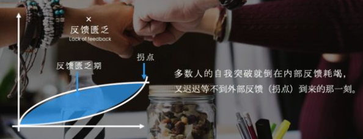

### 困境

想想看，你所经历的**困境**是一种什么样的体验？在黑暗中迷茫没有方向？或是尝试努力后，几乎没有什么改变的那种窒息?

但我认为，你所有**困境的本质**，其实都是**选择**的问题。比如你偶尔去一趟西餐厅，对芝士大虾或香草羊排存在选择的困境。或者你新到一家公司，对“趋炎附势你的领导”或是“坚持自己的原则”存在困惑。再比如有人说，北上广容不下肉身，三四线放不下灵魂。你根本不知，如何选择未来。当然更多时候你连选项都没有，比如你和另一半最近相处难受，就是不知道选择什么方式去改善彼此。

但你有没有想过，选择为什么这么困难？恐怕只有一个问题，那就是**反馈**。你的一天大大小小会经历几百次选择，只是99%以上的选择都被你的潜意识机制，以默认“确定”的方式完成了。比如你早上起来要不要喝水？坐飞机是选择靠窗还是过道？和同事在电梯相遇是say hello还是微笑点头？只是这些问题在长期体验中是**趋于稳定的确定性反馈**：早上喝一杯水有身体舒服的反馈，倾向过道是因为可以早点下飞机，电梯直接打招呼是因为同事的回应也更好。

但人生的困境在于，我们如何要面对那些**不确定性反馈**。

> 面对人生的各种**难题**，我们选择了**某个方法**进行**尝试**，最后的**反馈**是**不确定性**，可能成功、可能失败，正是这种**不确定性**才会让人恐惧。
>
> 当人知道某件事情，我通过**某种方式**处理后，事情就一定会朝着我希望的方式去发展，此时人内心是确定的，没有恐慌，当你**知道这样的方法越多**，你就越自信，这就是我们所说的经验吧！人这一辈子都在寻找的东西。

### 突破的困难

寻求自我突破的过程，本质是**一个把“不确定性反馈”变为“确定性反馈”的过程**。几乎每一个减肥的人，都梦想获得一个“确定一个月就能瘦15kg”的方法。而如果你正在找工作，肯定也渴望得到一个“确定能面试通过”的技能。所以你会付出行动，不断尝试。但所有的改变，都可能遭遇两难问题：

* **内部反馈**的乏力

  你尝试写一个公众号，一开始你自己会感觉成就感特别大，自己都暗自佩服“原来我也能写这么好的文章”，家人朋友也会惊叹你会写这么好的文章，积极地给你许多反馈。所以你很有动力去写每一篇。

  但随着时间推移，无论你自己或身边人的对于这种新鲜刺激逐渐变少，形成了对数增长的效果（一开始增长明显，后来趋于平缓）。几乎所有的内部反馈都是如此，比如健身、学一个新的技能，刚开始的改变会很大，但会迅速进入瓶颈期。

  

* **外部反馈**的不及时

  如果我们从内部反馈中得不到有力的反馈，我们就会寻找依赖外部反馈。

  比如你公众号的粉丝的反馈，但这往往是一种指数增长的模式（一开始增长平缓，到了某个节点后增长明显）。再比如你尝试改变你孩子的坏习惯，一开始的效果反馈并不明显，到后面才会更好一些。

  但多数人的自我突破就倒在内部反馈耗竭，又迟迟等不到外部反馈（拐点）到来的那一刻。

  

### 解决方案

面对这个两难问题，你该如何调整？有一个启发是，想想在原始社会，原始人生活的不确定性远比现代人高出很多，他们是如何去应对呢？

原始人的生存法则里，没有现代人那么的复杂干扰。理解他们的规则，很容易让我们找到事物的本质。比如我想到了“原始人如何熬一锅鲜汤”的场景，我列出其中最重要三个方面，方便你的形象化理解：

1. “肉块和蔬菜”，煮汤首先得有食材，丰富的食材通过**互换**才能获得。自我突破的第一层，核心是：从**价值表达**思维到**价值供给**思维。
2. “火堆”，原始人对于火有控制才能煮汤。自我突破的第二层，核心是：从**自我控制**到**自我赋能**。
3. “盐粒”，撒盐是煮汤的最后一步，盐入汤内看不见了，却无处不在。自我突破的第三层，核心是：从**自我思维**到**无我思维**。

**▍“肉块和蔬菜”，从价值表达思维到价值供给思维**

一个原始部落的男人狩猎到一头野猪，突然得到了很多肉。但是晚上想吃蔬菜水果怎么办呢？那就拿出一小块肉和负责采集的女人**换**。如果要煮一锅汤，那就还需要再拿出一些肉，**换**一些锅碗，再**换**一些盐。

**要活下来**，你就要**提供自己的价值去交换别人的价值**，这是人类社会**最核心的生存法则**，**价值供给**。

情况如果稍微复杂一些，比如某一天在部落市场，男人提供狩猎回来的肉，但却有十个女人提供蔬菜。女人感到“肉”这个资源的稀缺，就会极力去夸大自己今天采摘的菜果有多好，甚至贬低别人的有多烂。人是社会性动物，为了生存，人类个体就必须要对群体展现自己的一定价值。这是**边缘生存法则**，**价值表达**。但叫嚣几句“我的东西更好”(价值表达）远比“我要提供给你足够满意的菜果”（价值供给）要容易很多。所以这个世界逐渐就行成了一个有趣的现象，**很多人更注重表达价值而非提供价值**。

> 一个原始部落的男人猎到一头野猪，用肉跟采集蔬菜的女人交换、跟制作锅碗的工匠交换、跟制盐的交换，这样晚上就可以享受一锅鲜美的肉汤了。**这个过程的前提是你得知道猎杀野猪的方式**。高手对事物的发展是确定的，普通人无法确定事物会怎么发展。

比如你经常会在办公室看到许多人都在极力维护“我是对的”，“我比你强”，却忽略了自己能为别人提供什么价值。那些处理不好自己感情的人也同样如此，太注重表达自己的付出太多，却忽略了提供舒适、关爱等价值。

这是尝试自我突破的第一步，**如何去提供价值，从而在外部中获得反馈**。

**▍“火堆”，从控制思维到赋能思维**

自从发明了钻木取火，获得对火的控制，原始人才能开始烤肉或煮汤。对于火的使用表面来看是一种控制，但最核心的其实是源源不断添加的木材。

对于自我突破也同样如此。**表面**看来，那些大神都是**通过高度自我管控才实现突破**。但实际他们是做好了“赋能”，即**源源不断赋予自我或团队以能量**。

什么概念呢？给大家分享一个故事就明白了：作为曾经的公路自行车爱好者，有一次我和一个前省级公路自行车队的朋友在周末相约骑行。当天很热，我们的目标是70km外的一个古镇，当天来回。那是我第一次骑那么远。在一段持续上坡后，我就累得不行了。即使停下来几次还是很累，朋友仔细观测后，发现是我骑行姿势的问题，导致单次呼吸的时候，没有大量的氧气进入肺部。我调整以后好多了，但是骑了50km后，看着导航还有20km的距离，就又感觉不行了。朋友的建议是，**千万不要总是盯着最终那个目标**。要研究每一段路，比如这个弯道如何去压弯，这个直道采取什么样的呼吸频率。总之那次才真正学会了骑行，从小镇回来后的那70km就显得十分轻松了。

多数人以为的成功，就是咬紧牙关，拼搏到70km以后。但想想那个可怕的人生拐点，你需要坚持多久，才能达到。

记住一个概念，**如果你是用意志力来完成突破，那多半你还停留在初级水平**。在高手的眼里，**成长**充满了**乐趣**。他们完全找到了沿途**自我赋能**的方法（做事的方式），源源不断给自己以能量（达到真正的控制事物发展的走向）。这是尝试自我突破的第二步，如何从控制思维变为学会自我赋能，从而**获得更多内部反馈**。

> 自律是**去人性化**的过程，也是机械思维，通过大量重复活动获得某方面的成就。这种成就必须获得内部或者外部的反馈才能得以持续：
>
> * 对内：人体内的奖赏机制，自我满足，代表人物：乔布斯对产品的极致追求、日本匠人60年只做一件事。
> * 对外：有平台可以展示这些成就，并得到外部人员的认可。现在的网红经济极为明显。

**▍“盐粒”，从自我思维到忘我思维**

“原始人熬一锅鲜汤”的最后一步：盐入汤内，形态消失，却无处不在。这也是老子所说的“大象无形”，最厉害的，往往都看不到形态，也就是“忘我”境界。但多数时候我们更**像汤内的一根骨头**，永远保持着**自我的形态**。因为有了自我，才会难以放下自己所谓的身份。这却是**阻碍我们自我突破的，最关键原因**。

为什么这么说呢？

开篇讲到，你每天99%的决策都被**潜意识**自动完成，这很像一个原始部落。每天做事的，都是部落群众，它们人数众多力量强大，可以做狩猎、采集、修房子等等很多事。但是他们没有头脑，经常容易冲动。他们其实就是弗洛伊德所说的“本我”的部分。而部落里有个酋长，负责处理群众无法处理的脑力问题。他地位最高，控制着群众。不过因为力量有限，也经常出现失控的情况，这就是“自我”的那部分。而原始部落都崇拜神、图腾这些东西，这些是他们生命的意义，也有道德约束。这就是“超我”那部分。弗洛伊德的观点是，我们应该发挥图腾崇拜（超我），让酋长（自我）加强管理，打压群众（本我）。因为原始群众（本我）的脑子简单，他们自私，充满欲望。应该被好好约束，才能让整个部落发展更好。这就是我们从小接受的价值观，发展道德等“超我”，让理性的“自我”来约束感性的“本我”。

但自弗洛伊德以后，西方主流心理学派却提出了不一样的观点。比如温尼科特提出：“让你的本能排山倒海般涌出！”其含义是，应该让原始部落群众自由发挥力量，他们才是决定部落命运的绝对力量。之所以我们的“本我”经常被“自我”压抑，主要是因为“自我”这个酋长具有语言能力，他可以对任何事进行评判。然后那些部落群众就跟着傻乎乎的相信了，导致他们根本发挥不出应有的潜能。

所以，**最高级的自我突破，其实是忘掉“自我”，发挥“本我”**。无论是老子追求的“无为”，佛的“无我”，马斯洛的“自我实现”，卡尼曼追求的“高峰体验”，都是在追求这种境界。这是我们人生突破的第三个阶段。

### 总结

总结一下，我们所有的困境都是因为没有确定性的选择而产生，而选择的关键在于反馈。

反馈是由内部和外部构成，外部反馈应该由提供价值来获得，而内部反馈应该自我赋能来获得。而最顶级的高手是应该不断追求忘我境界，放弃自我和对他人的评判，才能完全发挥潜意识的无穷力量，实现自我突破。

想起《三体》中有一段这样的话：“生存在宇宙中，本身就是一件很幸运的事情，但是不知道什么时候起，人类有了这样一种幻想，认为生存是唾手可得的，这就是他们失败的根本原因。”

生命的意义就在于**努力生存**，最伟大的生存就是活出最初的本我。致敬，那些正在努力寻求自我突破的人。